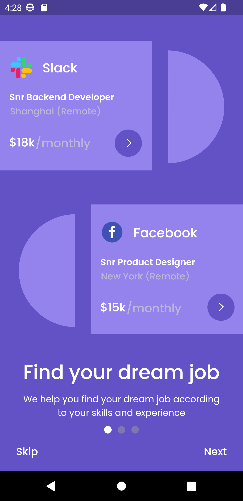
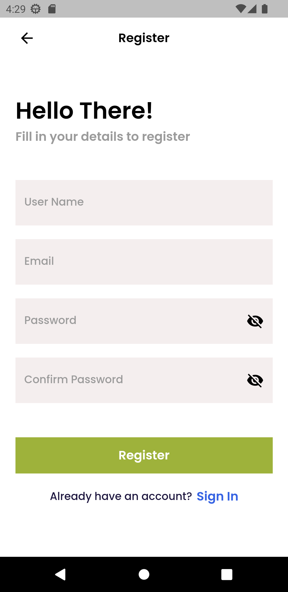
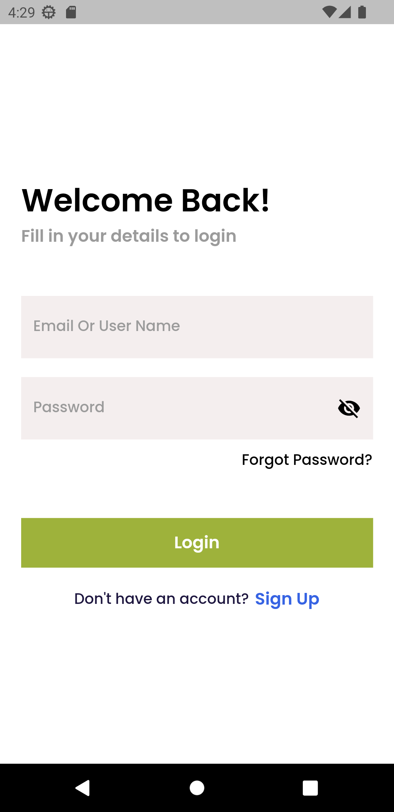
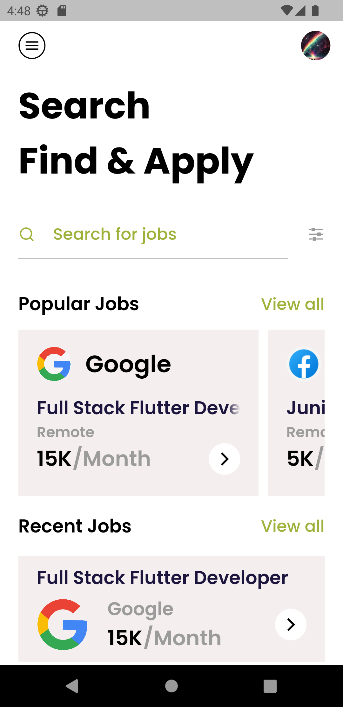
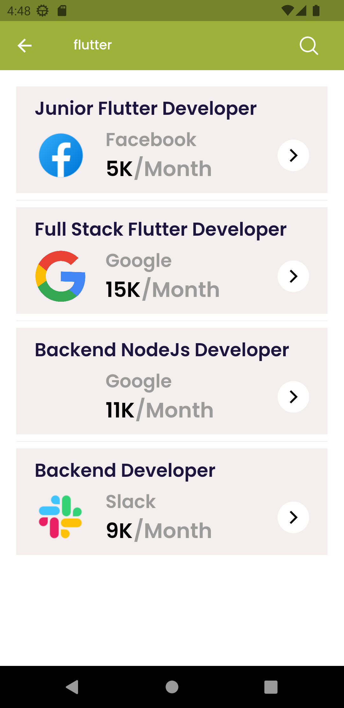
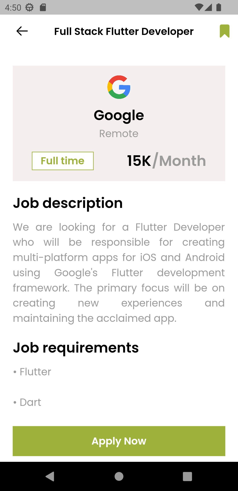
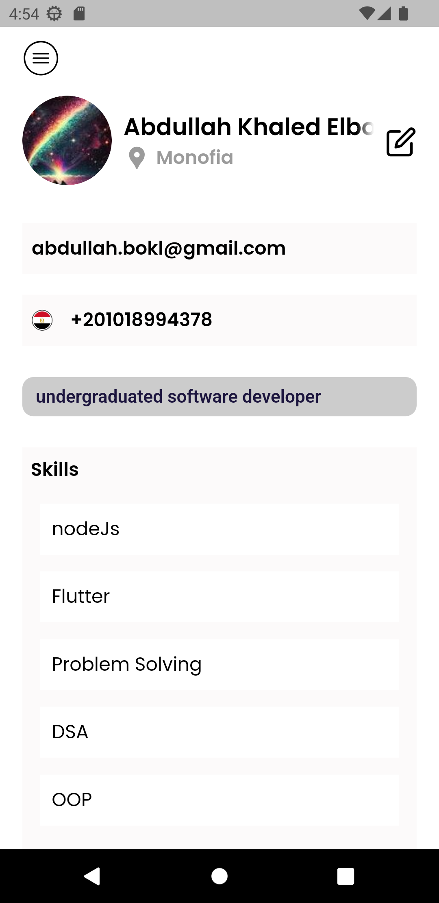
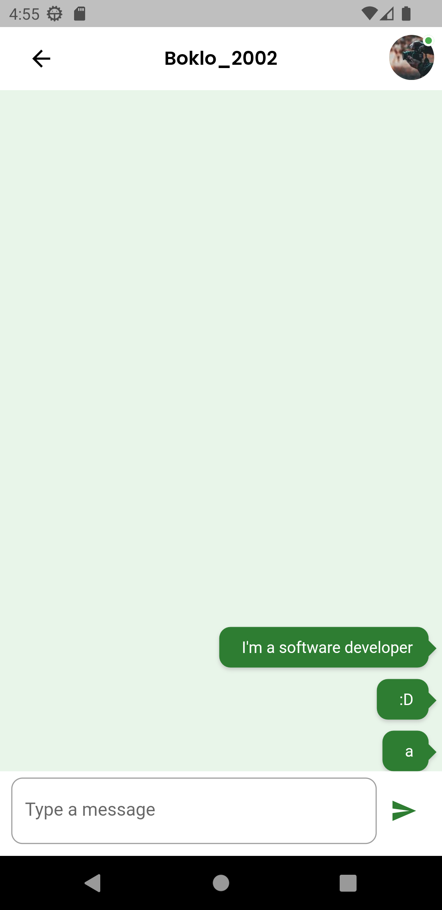
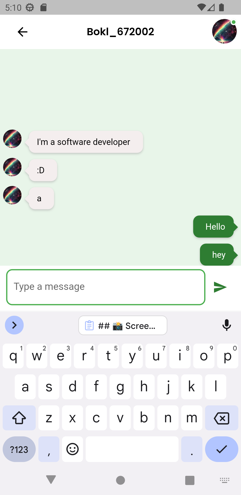

# Job-Hub App

Job-Hub is a comprehensive full-stack Flutter application that leverages the power of Flutter, Node.js, Express, and MongoDB.

## 📹 Video Demo : [Flutter Job-Hub App](https://drive.google.com/file/d/1FzZiJvblUbaJRt4G9fTcz6Ioz0WWRTxG/view?usp=drive_link)

## ✨ Features :

- ✨ Splash screen with our unique app logo.
- 🔒 Secure authentication and user registration.
- 🛡️ Robust input validation for data accuracy.
- 🔄 First login profile setup to get you started.
- 📷 Upload your profile picture.
- 💼 Specify your skills and additional profile details.
- 💬 Real-time chat using sockets for seamless communication.
- 🏡 Home screen with recent and popular job listings.
- 📌 Bookmark your favorite jobs for easy access.

## Technologies Used:

- 📱 Flutter
- 🌐 Node.js
- 🚀 Express
- 🗄️ MongoDB
- 📦 Socket.io
- 📦 JWT
- 📦 Bcrypt
- 📦 Multer

## 🏗️ Architecture: Feature-first layered architecture
## 🔄 State Management: flutter_bloc + Cubit
## 🧭 Navigation: go_router

## 📦 Backend : [NodeJS Job-Hub App](https://github.com/abdullahbokl/boklo_jobhub_backend)

## 📸 Screenshots :

  
  
  
  

## Performance

- Profile-mode workflow and jank triage steps live in [docs/performance.md](docs/performance.md).
- Enable the Flutter performance overlay with `--dart-define=SHOW_PERFORMANCE_OVERLAY=true`.
