# Job Hub

Job Hub is a full-stack Flutter job marketplace app built for both job seekers and hiring teams. It combines a polished mobile UI with a production-style architecture, real-time messaging, role-based navigation, applicant tracking, job management, and a Node.js + MongoDB backend.

## Backend

[NodeJS Job-Hub App](https://github.com/abdullahbokl/boklo_jobhub_backend)

## Video Demo

[Flutter Job-Hub App](https://drive.google.com/file/d/1edqqqNHcll_Mdcq-ScWlWC94n1HsTcY8/view?usp=sharing)

## Screenshots

The screenshots below are ordered from app startup through the seeker flow and then the company flow.

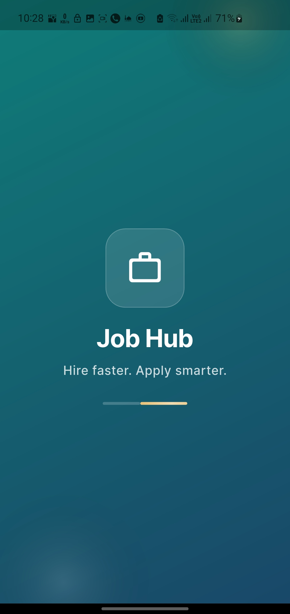 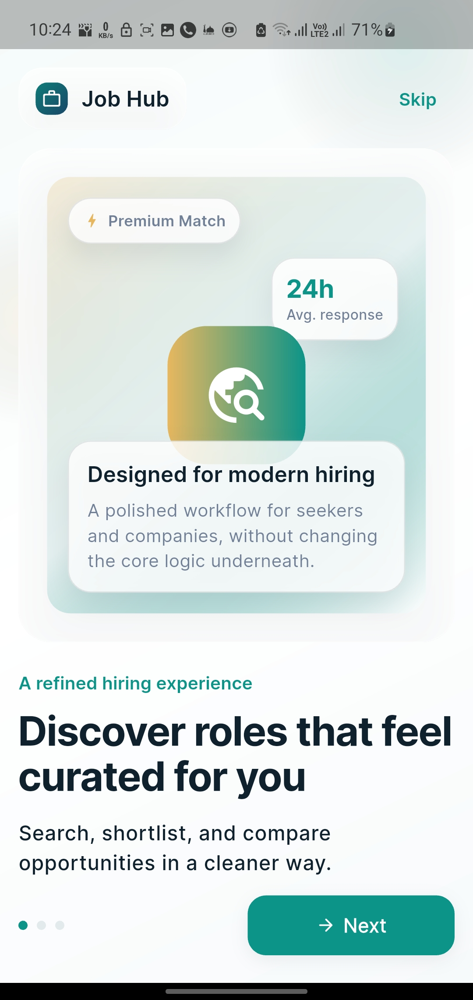 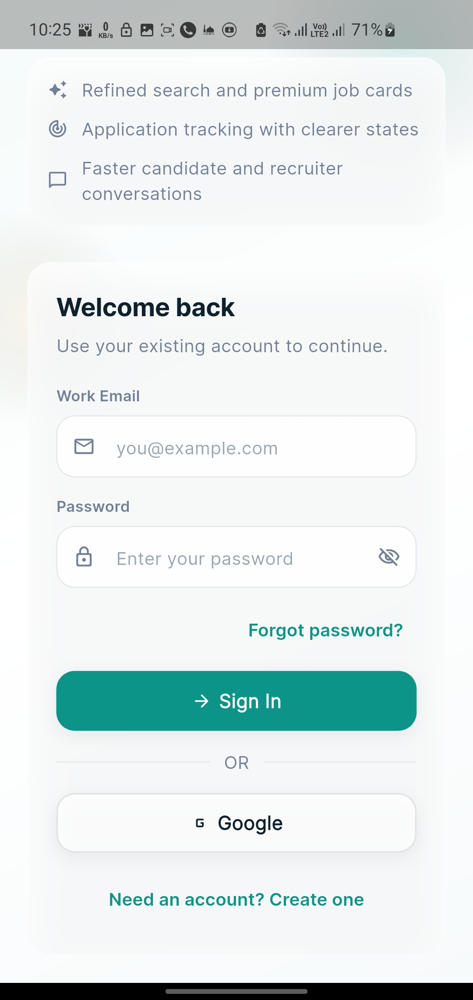
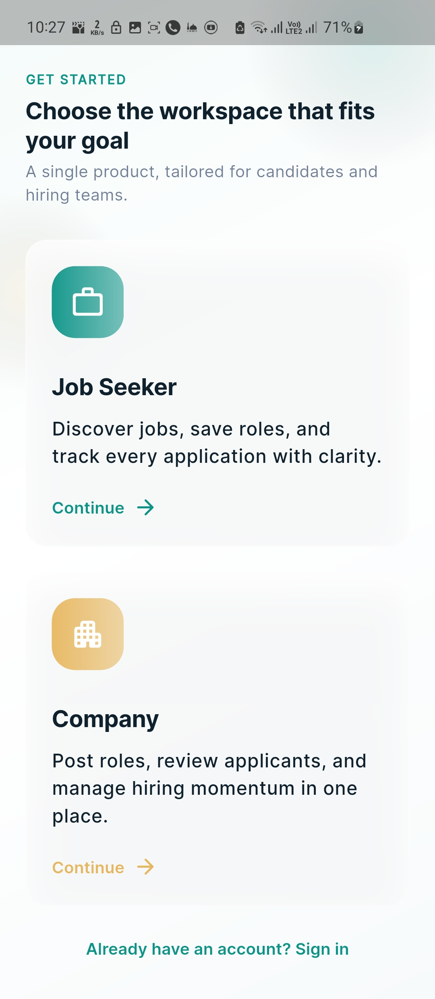 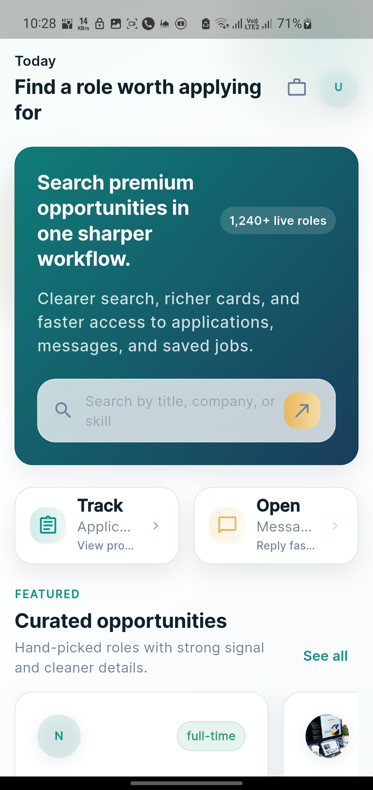 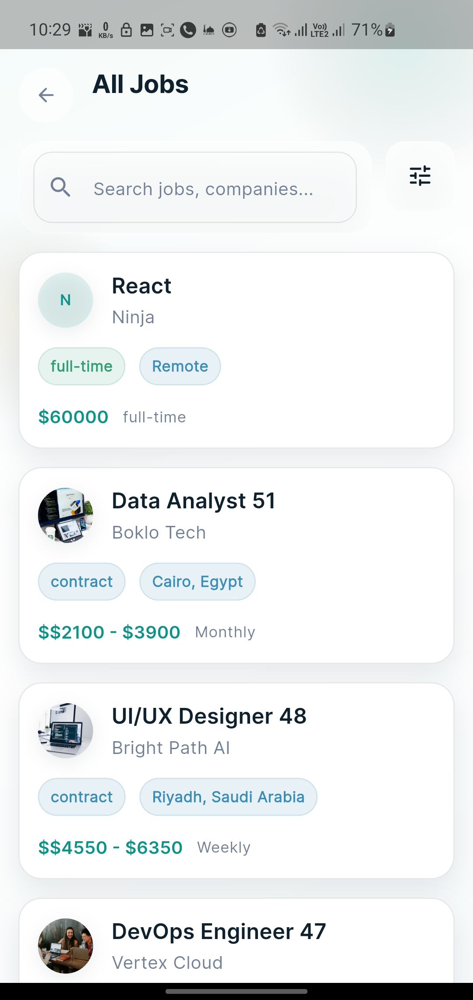
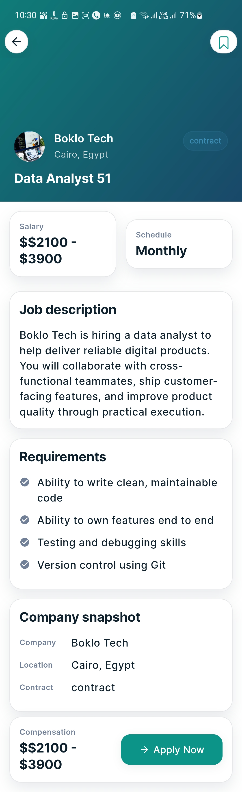 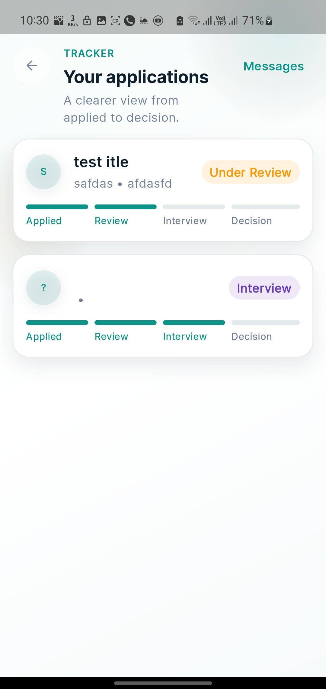 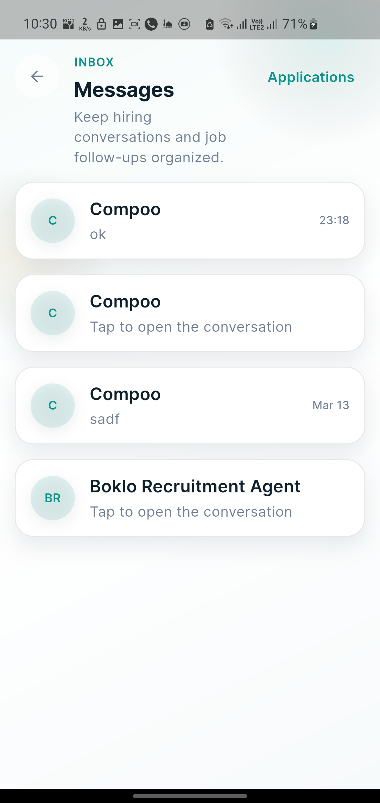
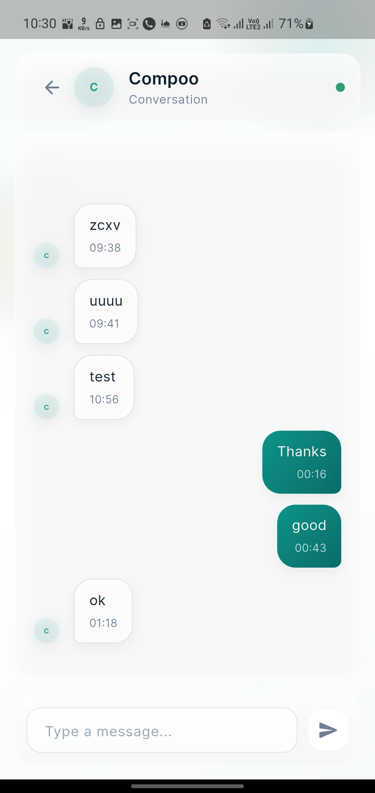 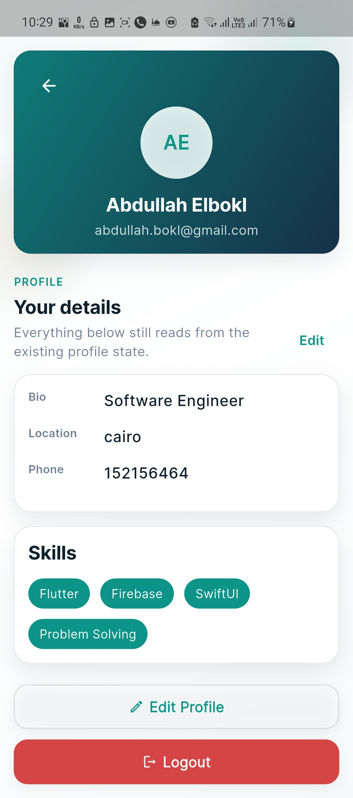 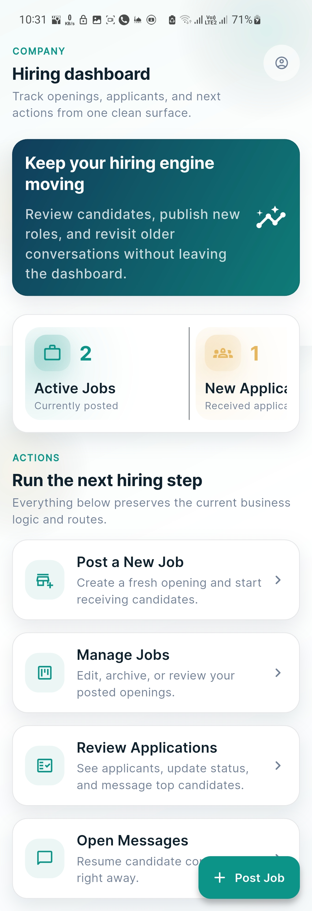
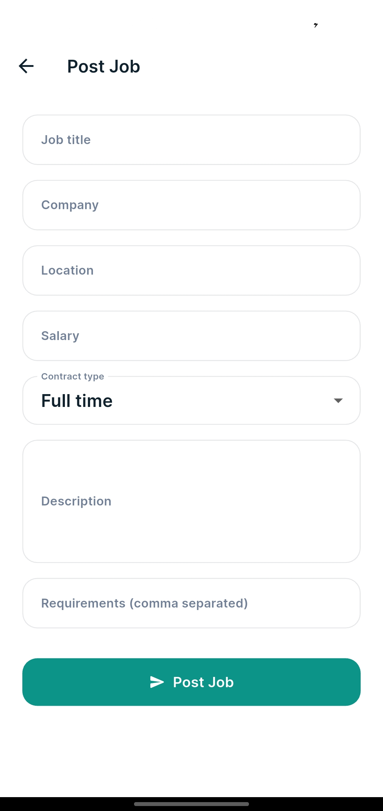 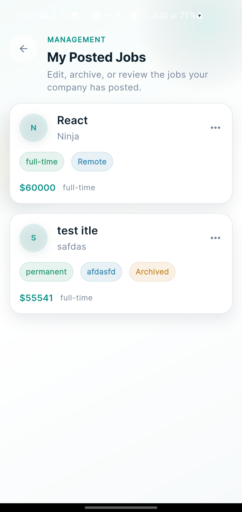 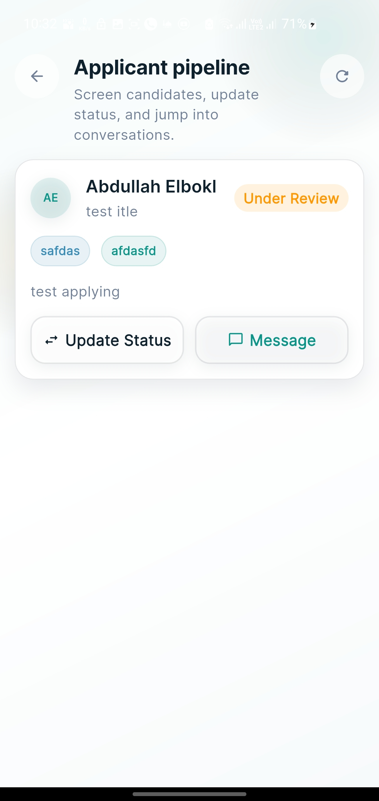

## Why This Project Stands Out

- Dual-product experience in one app: the UI and routing adapt for both job seekers and companies.
- Real-time messaging: candidates and recruiters can move from applications directly into live conversations.
- Applicant pipeline management: companies can review incoming applications, update statuses, and message candidates from the same workflow.
- Feature-first layered architecture: the codebase is split into `data`, `domain`, and `presentation` layers inside each feature.
- Fast startup strategy: the app uses a two-phase bootstrap so the first frame can render quickly before the full dependency graph loads.
- Production-minded navigation and session handling: JWT restoration, session hydration, 401 cleanup, and role-based redirects are already wired in.
- Search and browse flow with depth: debounced search, filter bottom sheet, pagination, and separate management views for posted jobs.
- Performance-aware implementation: repaint boundaries, profile-mode guidance, startup tests, and cubit behavior tests are included.

## Feature Overview

### Job Seeker Features

- Splash screen and onboarding flow for first-time users.
- Login and registration flows with role-aware account creation.
- Role selection between `Job Seeker` and `Company`.
- Personalized home dashboard with featured jobs and quick actions.
- Browse jobs with search, filters, and paginated loading.
- Rich job details screen with company snapshot, requirements, salary, and contract information.
- Apply to jobs with cover letters.
- Track application progress through stages like `Applied`, `Review`, `Interview`, and `Decision`.
- Bookmark jobs and manage a shortlist of saved opportunities.
- Real-time conversations with recruiters.
- Profile viewing and editing with skills, bio, education, experience, and avatar support.

### Company Features

- Dedicated company dashboard instead of the seeker home screen.
- Create new job posts.
- Edit existing jobs.
- Archive, restore, or delete posted jobs.
- Review incoming applications in an applicant pipeline view.
- Update application status directly from the company workflow.
- Open or resume chat with applicants from the applications screen.
- Track posted job count and received application count from dashboard metrics.
- Company-specific profile details such as company name, industry, and website.

## Advanced Features

### 1. Two-Phase App Bootstrap

The app startup is intentionally split into two stages:

- `prepareForFirstFrame()` registers only the minimum infrastructure needed to paint the first screen quickly.
- `completeDeferredBootstrap()` finishes the heavier dependency registration and session hydration while the splash screen is shown.

This gives the project a more production-ready startup story than a single blocking initialization path.

### 2. JWT Session Restore and Hydration

Session handling is more advanced than simple local storage:

- cached JWTs are restored from `SharedPreferences`
- expired tokens are rejected before the user enters the app
- the user role is restored immediately
- the user id is hydrated from the JWT payload during deferred bootstrap
- unauthorized `401` responses clear the stale session and force clean re-entry

### 3. Role-Based Navigation With `go_router`

Navigation is guarded at the route level:

- first-time users are sent to onboarding
- returning unauthenticated users are sent to login
- authenticated seekers land on `/home`
- authenticated companies land on `/company/dashboard`
- authenticated users cannot navigate back into onboarding or auth screens by mistake

### 4. Real-Time Messaging With Socket.IO

The chat system is not static polling:

- the app joins chat rooms through Socket.IO
- incoming messages are appended live
- outgoing messages are echoed into local state instantly
- typing and stop-typing events are supported
- a shared `ChatSyncService` broadcasts chat updates across screens without forcing full reloads
- conversation screens auto-scroll to the latest message

### 5. Applicant Pipeline Workflow

The hiring workflow is one of the strongest features in the app:

- companies see all received applications in one place
- each application shows the candidate, job, status, and summary data
- statuses can be updated inline
- the flow supports application progression across hiring stages
- recruiters can jump from an application directly into chat with a candidate

### 6. Search, Filters, and Pagination

The jobs experience goes beyond a simple list:

- text search is debounced
- filters include location, contract type, and salary range
- pagination is tracked through `page`, `limit`, and `hasMore`
- the list can load additional pages without resetting the existing results
- there is a dedicated management mode for company-owned jobs

### 7. Premium UI System

The app uses a custom premium-styled UI approach rather than plain default Material layouts:

- reusable glass and premium card surfaces
- branded gradients and hero panels
- responsive layout support through `flutter_screenutil`
- reusable chips, buttons, avatars, and status badges
- dedicated empty, loading, and error states

### 8. Connectivity and Resilience

- an app-level connectivity wrapper shows a visible offline banner
- networking is centralized behind a Dio-based API service
- file uploads are supported through multipart requests
- server errors are mapped into user-facing failures through shared error handling

### 9. Testing and Performance Guardrails

This repository includes meaningful quality checks, not just placeholder tests:

- startup tests verify bootstrap and splash navigation behavior
- cubit tests cover debounced job search
- cubit tests cover paginated loading behavior
- chat tests verify typing state updates without unnecessary message-state re-emits
- widget tests validate premium UI behavior and job filter interactions

The repo also includes a dedicated performance workflow document for profile-mode testing and jank triage.

## Architecture

The project follows a feature-first layered architecture.

Each feature is organized into:

- `data`: repositories, models, and remote data sources
- `domain`: entities and use cases
- `presentation`: pages, widgets, and BLoC/Cubit state management

Core app-wide concerns live in `lib/core`, including:

- dependency injection with `get_it`
- routing with `go_router`
- shared widgets
- theme and design tokens
- app/session utilities
- network services
- bootstrapping logic

## Tech Stack

### Frontend

- Flutter
- Dart 3
- `flutter_bloc`
- `go_router`
- `dio`
- `get_it`
- `socket_io_client`
- `connectivity_plus`
- `cached_network_image`
- `flutter_screenutil`
- `equatable`
- `fpdart`

### Backend

- Node.js
- Express
- MongoDB
- JWT
- Bcrypt
- Multer
- Socket.IO

## Project Structure

```text
lib/
  core/
    common/
    config/
    errors/
    navigation/
    services/
    theme/
    utils/
  features/
    applications/
    auth/
    bookmarks/
    chat/
    home/
    jobs/
    on_boarding/
    profile/
    search/
    splash/
  main.dart
  my_app.dart
test/
docs/
```

## Getting Started

### Prerequisites

- Flutter SDK installed
- Dart SDK installed
- Android Studio or VS Code
- Android emulator or physical device
- Running backend server from the linked Node.js repository

### Installation

```bash
git clone <your-repo-url>
cd Flutter-NodeJS-Full-Stack-App
flutter pub get
```

### Run the App

For local development, start the backend first, then run:

```bash
flutter run
```

### Run With Explicit API and Socket URLs

For physical devices or repeatable testing, prefer explicit `dart-define` values:

```bash
flutter run \
  --dart-define=API_BASE_URL=http://<host-ip>:7000/api/v1 \
  --dart-define=SOCKET_URL=http://<host-ip>:7000
```

### Environment Configuration

The app supports flavor-aware configuration through `AppConfig`:

- `FLAVOR=dev`
- `FLAVOR=staging`
- `FLAVOR=prod`

You can also override both base URLs directly:

```bash
flutter run \
  --dart-define=API_BASE_URL=http://<host-ip>:7000/api/v1 \
  --dart-define=SOCKET_URL=http://<host-ip>:7000 \
  --dart-define=SHOW_PERFORMANCE_OVERLAY=true
```

## Test Commands

Run all tests:

```bash
flutter test
```

Useful coverage areas in this repo include:

- startup and bootstrap tests
- widget tests for premium UI and filters
- cubit tests for chat behavior
- cubit tests for debounced search and pagination

## Performance

Performance notes and profile-mode workflow live in [docs/performance.md](docs/performance.md).

Highlights:

- profile-mode run instructions
- performance overlay guidance
- frame stats workflow
- jank triage scenarios
- acceptance bar for scroll and route smoothness

## Highlights For Recruiters and Reviewers

If you are reviewing this project for hiring or portfolio purposes, the strongest technical areas to inspect are:

- startup/bootstrap strategy in `AppSetup`
- role-aware routing and redirect logic
- real-time chat and message synchronization
- seeker/company dual experience in one codebase
- jobs search, filters, and pagination
- application lifecycle and hiring pipeline flow
- test coverage around startup, state management, and UI interaction

## Author

Abdullah Elbokl
